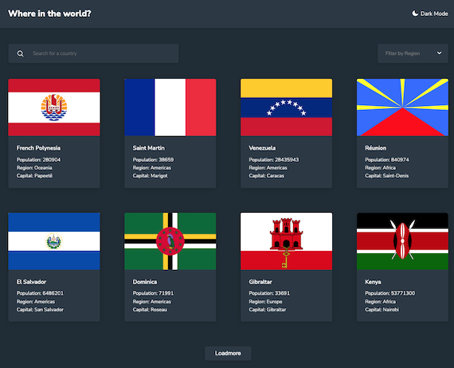

# Frontend Mentor - REST Countries API with color theme switcher solution

This is a solution to the [REST Countries API with color theme switcher challenge on Frontend Mentor](https://www.frontendmentor.io/challenges/rest-countries-api-with-color-theme-switcher-5cacc469fec04111f7b848ca). Frontend Mentor challenges help you improve your coding skills by building realistic projects. 

## Table of contents

- [Overview](#overview)
  - [The challenge](#the-challenge)
  - [Screenshot](#screenshot)
  - [Links](#links)
- [My process](#my-process)
  - [Built with](#built-with)
- [Author](#author)
- [Acknowledgments](#acknowledgments)

## Overview

### The challenge

Users should be able to:

- See all countries from the API on the homepage
- Search for a country using an `input` field
- Filter countries by region
- Click on a country to see more detailed information on a separate page
- Click through to the border countries on the detail page
- Toggle the color scheme between light and dark mode *(optional)*

### Screenshot

### Links

- Solution URL: [https://github.com/K-ost/countries-api](https://github.com/K-ost/countries-api)
- Live Site URL: [https://k-ost.github.io/countries-api/](https://k-ost.github.io/countries-api/)

## My process

### Built with

- Semantic HTML5 markup
- CSS custom properties
- Flexbox
- CSS Grid
- Mobile-first workflow
- React Context
- React Router DOM
- TypeScript
- [React](https://reactjs.org/) - JS library
- [Styled Components](https://styled-components.com/) - For styles
- [React Select](https://react-select.com/) - For select styles

## Author

- Website - [https://github.com/K-ost](https://github.com/K-ost)
- Frontend Mentor - [@K-ost](https://www.frontendmentor.io/profile/K-ost)

## Acknowledgments

Start app: npm run dev
Search by the name is made on client side and pagination as well. Because, as far as I understood this API doesn't provide such opportunity. The endpoint of all countries gives the entire list of countries. At least I couldn't find a possibility to use parameteres.
